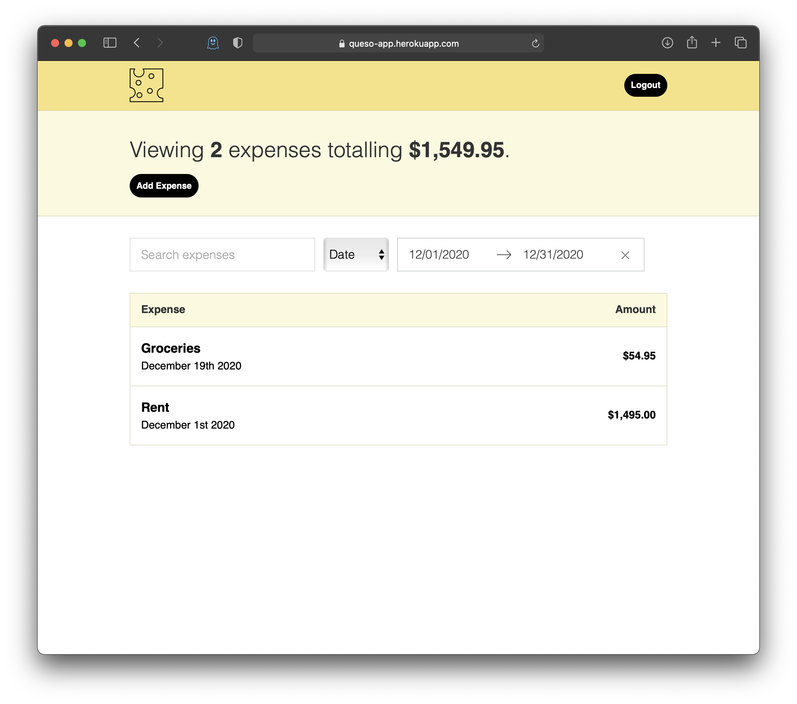

# QUESO - A simple expense manager.



## About

Most modern expense managers or budget apps have many great features, but sometimes these long lists of incredible features can make it difficult to use the service. I created Queso to make the process of managing expenses simple for all.

- There is no need to link your bank account.
- There is no need to define your budget.
- Simply add expenses, filter by day, month, or year, and sort by date added or by amount.

The ease of use of queso makes it possible to control your expenses with no learning curve. Most importantly, all your expenses are synced up between all of you devices through you Google account!

## Built With

- Babel
- Babel Polyfill
- Firebase
- Express
- Webpack
- React
- Redux
- Validator
- Moment
- History
- Jest
- React Test Renderer

## Getting Started

You can use the application by visiting https://queso-app.herokuapp.com/

If you wish to contribue to this project, or create your own fork, you can do so by using the following steps.

### Installation

#### Prerequisites

- npm (installed with Node.js https://nodejs.org/)
- Yarn

```
npm install -g yarn
```

1. Clone the repo

```
git clone https://github.com/mrivasperez/queso-app.git
```

2. Install Yarn Packages

```
yarn install
```

## Contributing

Contributions are what make the open source community such an amazing place to learn, inspire, and create. Any contributions you make to queso are greatly appreciated.

Fork the Project
Create your Feature Branch (git checkout -b feature/AmazingFeature)
Commit your Changes (git commit -m 'Add some AmazingFeature')
Push to the Branch (git push origin feature/AmazingFeature)
Open a Pull Request

## License

Distributed under the MIT License. See LICENSE for more information.
